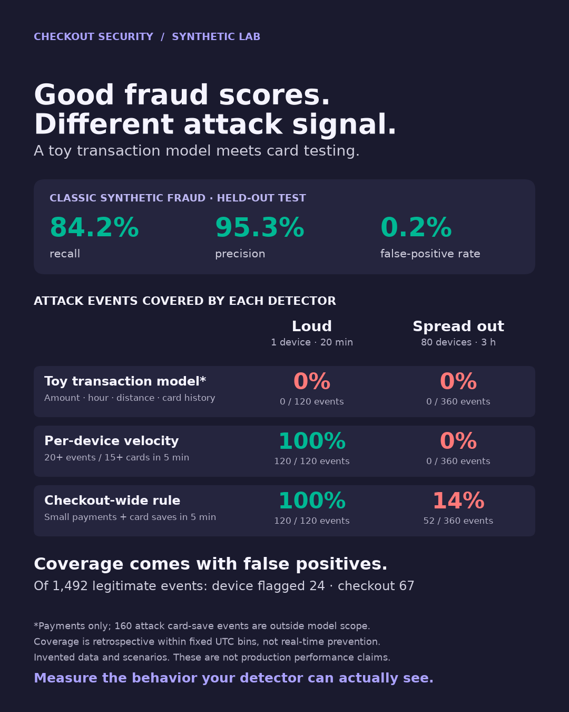

# Card testing detection lab

I wanted to know whether a typical fraud model would catch card testing, so I built a small lab to find out. The model missed every attempt. Counting cards in Splunk caught the loud attack completely, but only part of the quiet one.

Card testing is when someone runs stolen cards through a checkout, as tiny payments or $0 card saves, to see which cards still work. Each attempt looks like a normal customer buying something small. You only see the attack when you start counting.

The lab generates a fake checkout: 1,972 events over four hours, with ordinary shoppers and two card-testing attacks mixed in. It trains a simple fraud model on classic fraud, then runs counting rules in Splunk. For every detector, I checked what it caught and which real customers it flagged by mistake.

<!-- markdownlint-disable-next-line MD033 -->
<p align="center"></p>

## What happened

| Detector | Loud attack (120 attempts, 1 device, 20 min) | Spread attack (360 attempts, 80 devices, 3 h) | Real customers flagged (of 1,492) |
| --- | --- | --- | --- |
| Fraud model | 0 of 80 payments | 0 of 240 payments | 0 |
| Per-device rule (D1) | **120 of 120** | 0 of 360 | 24 |
| Checkout-wide rule (D2) | **120 of 120** | **52 of 360** | 67 |
| Decline rule (D0) | 0 of 120 | 0 of 360 | 0 |

D1 flags a device with 20+ attempts and 15+ different cards in 5 minutes. D2 does the same count across the whole checkout, but only for card saves and payments of $1 or less. D0 is D1, but only when 80% or more of the attempts were declined.

The model is fine at its own job. It was trained on classic fraud: big late-night purchases, far from home. On that it gets 84% recall and 95% precision. But every card-testing payment scored under 0.001 against its 0.48 threshold. And it never looked at the 160 card saves, because it only scores payments.

90% of the attack attempts were approved, so the decline rule never fired.

Counting cards per device caught the loud attack. The spread attack never put more than 2 attempts on one device in 5 minutes, so D1 missed all of it. D1 also flagged 24 real customers on a shared terminal.

Counting across the whole checkout caught 52 of the 360 spread attempts. But on its own the attack never put more than 14 card saves and small payments into a window, and D2 needs 20. Every one of those detections happened because real customers were shopping at the same time. On a quieter day, the spread attack would have gone straight through.

The [lab guide](docs/LAB_GUIDE.md#how-splunk-detected-each-attack) walks through each Splunk result, window by window.

## Run it

In Docker Desktop, go to Settings → Resources and give Docker at least 3 CPUs and 5 GB of memory, and keep about 6 GB of disk free. `start_lab.py` accepts the Splunk license and the [Splunk General Terms](https://www.splunk.com/en_us/legal/splunk-general-terms.html) for you, so read them first.

From the repo root:

```bash
python3 splunk/start_lab.py     # starts Splunk and loads data/card_testing_events.csv
python3 splunk/verify_lab.py    # should end with "14 of 14 checks passed"
```

Then open <http://127.0.0.1:8000>, set the time range to **All time** (the events are dated 26 September 2026), and follow the [lab guide](docs/LAB_GUIDE.md).

The first run pulls the Splunk image, about 4.5 GB. On an Apple Silicon Mac, Splunk runs under emulation and takes 3 to 5 minutes to start, so it will look stuck for a while. The Splunk scripts only need Python 3.8+, with no extra packages. On Windows, use `py` instead of `python3`.

### Regenerating the data

The easiest way is Colab: upload `card_testing_lab.ipynb` and choose Runtime → Run all. The last cell zips up the outputs.

Or run it locally with Python 3.12 or 3.13 (on Windows, activate with `.venv\Scripts\activate`):

```bash
python3 -m venv .venv && source .venv/bin/activate
pip install -r requirements.txt
python card_testing_lab.py --output-dir lab_output
```

With the default settings you get the same CSV, byte for byte (SHA-256 `b992512c715bf49c9b300cb00d1eb745bf3b191e0f436047480f63cd75556599`). To load a different file into Splunk, run `python3 splunk/start_lab.py --csv lab_output/card_testing_events.csv`. If the baseline is already loaded, [reset the lab](docs/LAB_GUIDE.md#stop-restart-or-reset) first. The launcher won't mix two datasets in one index.

## What's in the repo

```text
card_testing_lab.py         generates the events, trains the model, applies the rules
card_testing_lab.ipynb      the same thing for Google Colab
requirements.txt            pinned Python packages
data/
  card_testing_events.csv   the baseline events (seed 61027), with the Python flags
splunk/
  start_lab.py              starts Splunk in Docker and loads one CSV, once
  verify_lab.py             runs the searches and checks the results
  card_testing_rules.spl    the detection, parity and coverage searches
  compose.yaml              Splunk 10.4.3 on the Free license, bound to 127.0.0.1
  app/                      the Splunk app: index, CSV parsing, file input
docs/
  LAB_GUIDE.md              the step-by-step walkthrough, with screenshots
  images/
aws/
  probe-watch.yaml          the same lab live on AWS: API Gateway + WAF, a fake checkout on Lambda
  probe-watch-runbook.md    deploy, demo and teardown inside a 4-hour sandbox
  scripts/                  CloudShell helpers (AWS CLI only)
```

The `aws/` folder is the live version of this lab for the talk: one CloudFormation stack,
a traffic simulator that can only call its own API, and the per-device and checkout-wide
counts as CloudWatch Logs Insights queries plus an alarm. Still synthetic, still no card
numbers. See [aws/README.md](aws/README.md).

## Caveats

It's all made-up data. The generator plants the patterns the lab looks for, so the numbers show what each detector can see. They aren't real-world catch rates. There are no real card numbers or customer records, and nothing talks to a payment provider.

"Caught" means a rule flagged the event when looking back over its 5-minute window. That's not the same as blocking it in real time.

I'm not saying fraud ML can't catch card testing. Stripe has [written about how Radar does it](https://stripe.com/blog/how-stripe-radar-responded-to-a-new-wave-of-card-testing). My model just wasn't trained for it.

Splunk Free has no login, so the container only listens on 127.0.0.1.

## Further reading

- Stripe, [Protect yourself from card testing](https://docs.stripe.com/disputes/prevention/card-testing)
- Stripe, [How Stripe Radar responded to a new wave of card testing](https://stripe.com/blog/how-stripe-radar-responded-to-a-new-wave-of-card-testing) (January 2025), on card testing with rising approval rates
- OWASP, [OAT-001 Carding](https://owasp.github.io/www-project-automated-threats-to-web-applications/assets/oats/EN/OAT-001_Carding.html)
- Splunk, [docker-splunk](https://github.com/splunk/docker-splunk) and [About Splunk Free](https://help.splunk.com/en/splunk-enterprise/administer/admin-manual/9.4/configure-splunk-licenses/about-splunk-free)
