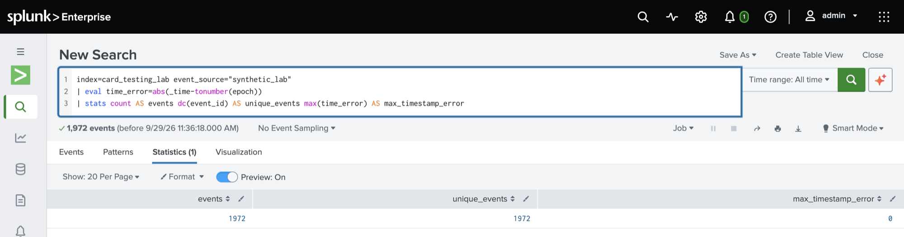
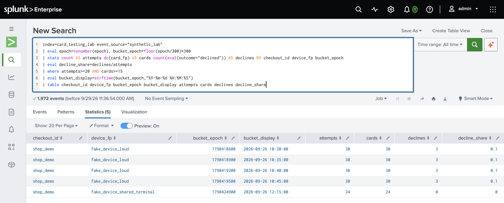
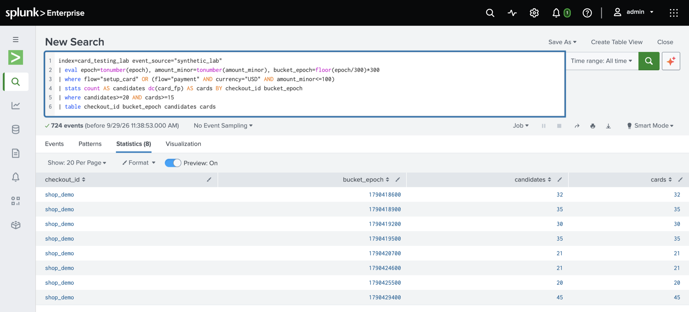
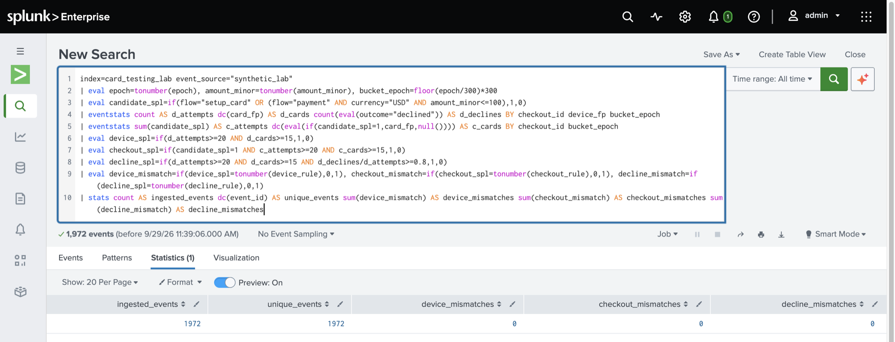
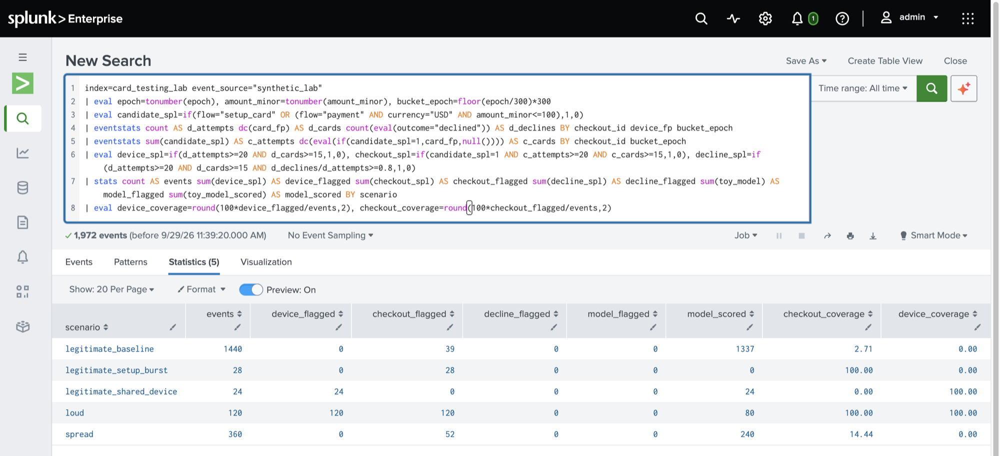

# Lab guide: detecting card testing in Splunk

This guide takes you from a fresh clone to the five Splunk results below and explains what each one shows. It takes about 30 minutes, most of it spent waiting for Splunk to start.

1. [The scenario](#the-scenario)
2. [The detectors](#the-detectors)
3. [Step 1: Get the events](#step-1-get-the-events)
4. [Step 2: Start Splunk and load the events](#step-2-start-splunk-and-load-the-events)
5. [Step 3: Check ingestion](#step-3-check-ingestion)
6. [Step 4: Per-device windows (D1)](#step-4-per-device-windows-d1)
7. [Step 5: Checkout-wide windows (D2)](#step-5-checkout-wide-windows-d2)
8. [Step 6: Parity with Python](#step-6-parity-with-python)
9. [Step 7: Scenario coverage](#step-7-scenario-coverage)
10. [How Splunk detected each attack](#how-splunk-detected-each-attack)
11. [Verify automatically](#verify-automatically)
12. [Try a variant](#try-a-variant)
13. [Troubleshooting](#troubleshooting)
14. [Stop, restart or reset](#stop-restart-or-reset)
15. [Design notes and limits](#design-notes-and-limits)

## The scenario

The events come from one invented shop, `shop_demo`, between 10:00 and 14:00 UTC on 26 September 2026. Every event is either a **payment** or a **card save** (`flow=setup_card`, amount 0), and is either approved or declined.

| Scenario | Events | What it represents |
| --- | --- | --- |
| `legitimate_baseline` | 1,440 | Ordinary customers, each with their own card and device. About 7% are card saves and 4% are declined. |
| `legitimate_shared_device` | 24 | A genuine shared terminal: 24 customers pay on one device within 5 minutes (12:15). |
| `legitimate_setup_burst` | 28 | A genuine onboarding rush: 28 customers save a card within 5 minutes (13:30). |
| `loud` | 120 | Card testing from **one device**: one attempt every 10 seconds for 20 minutes (10:30–10:50). |
| `spread` | 360 | Card testing from **80 devices** at random times over 3 hours (11:00–14:00). |

Both attacks use a new card for every attempt. Each attempt is a payment of $0.10–$1.00 or, one time in three, a card save. 90% are approved, like the higher-approval card testing [Stripe described in January 2025](https://stripe.com/blog/how-stripe-radar-responded-to-a-new-wave-of-card-testing).

## The detectors

Every rule uses fixed 5-minute windows aligned to UTC: `bucket_epoch = floor(epoch/300)*300`. The searches recompute each rule from the raw fields. `label` and `scenario` are used only afterwards, to score the results.

| ID | Detector | Flags an event when |
| --- | --- | --- |
| | Transaction model | A Random Forest trained on classic fraud (amount, UTC hour, distance from home and prior attempts on the card) scores the event at 0.48 or above. It scores **payments only**. |
| D1 | Per-device rule | Its device has at least 20 events and at least 15 distinct cards in the window. Both payments and card saves count, whatever the outcome. |
| D2 | Checkout-wide rule | It is a *candidate* (a card save, or a USD payment of 100 cents or less), and the checkout as a whole has at least 20 candidates and 15 distinct cards in the window. |
| D0 | Decline-gated rule | D1 matches, and at least 80% of that device's events in the window were declined. |

The model's scores are computed in Python and stored in the CSV (`toy_model`, `toy_model_scored`). Splunk doesn't train a model.

## Step 1: Get the events

The repository already contains the baseline events, `data/card_testing_events.csv`. To regenerate them, use either route:

**Google Colab.** Upload `card_testing_lab.ipynb` to [Colab](https://colab.research.google.com/) and choose Runtime → Run all (a CPU runtime is enough). The last cell packages the outputs as a ZIP. Set `DOWNLOAD_IN_COLAB = True` and rerun that cell, or download the ZIP from the Files panel. Colab runs on Google's servers, which can't reach Splunk on your computer, so download the CSV before loading it.

**Locally**, with Python 3.12 or 3.13:

```bash
python3 -m venv .venv && source .venv/bin/activate
pip install -r requirements.txt
python card_testing_lab.py --output-dir lab_output
```

Then check the fingerprint. With the default seed and settings, every route produces the same file:

```bash
shasum -a 256 lab_output/card_testing_events.csv
# b992512c715bf49c9b300cb00d1eb745bf3b191e0f436047480f63cd75556599
```

A different fingerprint means different settings were used. That's fine, but load that file into its own lab, not alongside the baseline (see [Try a variant](#try-a-variant)).

## Step 2: Start Splunk and load the events

Start Docker Desktop. Then, from the repository root, run one of:

```bash
python3 splunk/start_lab.py                                          # the bundled baseline
python3 splunk/start_lab.py --csv lab_output/card_testing_events.csv  # a file you generated
```

The launcher does three things:

1. It runs Splunk 10.4.3 under the Free license in a container named `card-testing-splunk`, listening only on 127.0.0.1.
2. It installs a small Splunk app that creates `index=card_testing_lab`, parses the CSV and takes each event's `_time` from the `epoch` column.
3. It copies the CSV in once, then restarts Splunk to index it.

Running it accepts the Splunk license and the [Splunk General Terms](https://www.splunk.com/en_us/legal/splunk-general-terms.html) on your behalf, so read them first.

On Apple Silicon, where the x86-64 image runs under emulation, the first start takes 3–5 minutes and loading the data takes about 3 more. Lines like `still starting (2 min)...` are normal. Rerunning the launcher is safe: it never loads the same data twice, and it refuses a different CSV rather than mixing two datasets in one index.

```text
Starting Splunk. The first start takes 3-5 minutes on Apple Silicon.
Loading data/card_testing_events.csv, default/app.conf, local/indexes.conf, ... and restarting Splunk...
  still starting (1 min)...
  still starting (2 min)...

Splunk is ready at http://127.0.0.1:8000 (Splunk Free, no login).
```

Open <http://127.0.0.1:8000> and choose **Search & Reporting**. For every search below, set the time range to **All time**. The events are dated 26 September 2026, so ranges such as *Last 24 hours*, or real-time ranges such as *30 second window*, return nothing. Paste and run each search on its own.

**Loading the CSV by hand instead**, for example into Splunk Cloud: go to Settings → Add Data → Upload and choose the CSV. Set the source type to **csv**. Under Timestamp, choose **Advanced**, set the timestamp field to `epoch` and the format to `%s`. Create and select the index `card_testing_lab`, then choose Review → Submit. Upload only once, and don't also use the launcher on the same Splunk: duplicate events inflate every count.

## Step 3: Check ingestion

Check that the data arrived intact before you interpret any detection result.

```spl
index=card_testing_lab event_source="synthetic_lab"
| eval time_error=abs(_time-tonumber(epoch))
| stats count AS events dc(event_id) AS unique_events max(time_error) AS max_timestamp_error
```



**Expected:** 1,972 events, 1,972 unique IDs and a timestamp error of 0.

- **Fewer events:** the time range is usually not set to All time.
- **More events than unique IDs:** the data was loaded twice.
- **A timestamp error above 0:** `_time` came from something other than `epoch`, such as the upload time. That breaks every 5-minute window.

## Step 4: Per-device windows (D1)

```spl
index=card_testing_lab event_source="synthetic_lab"
| eval epoch=tonumber(epoch), bucket_epoch=floor(epoch/300)*300
| stats count AS attempts dc(card_fp) AS cards count(eval(outcome="declined")) AS declines BY checkout_id device_fp bucket_epoch
| eval decline_share=declines/attempts
| where attempts>=20 AND cards>=15
| eval bucket_display=strftime(bucket_epoch,"%Y-%m-%d %H:%M:%S")
| table checkout_id device_fp bucket_epoch bucket_display attempts cards declines decline_share
```



**Expected:** 5 windows.

- **Rows 1–4 are the loud attack.** `fake_device_loud` used 30 different cards in each of four consecutive windows, from 10:30 to 10:45. One device cycling through many cards is the classic card-testing signature. D1 flags all 120 attack events.
- **`decline_share` is 0.1.** Nine in ten attempts were approved, so a rule that waits for a decline spike (D0, 80%) never fires.
- **Row 5 is a false positive.** `fake_device_shared_terminal` is 24 genuine customers paying on one shared device. To a per-device rule, many cards on one device looks like an attack.
- **The spread attack is missing.** Each of its 80 devices made 4–5 attempts over three hours, and never more than 2 in the same window. That is far below 20.

`bucket_display` is shown in your Splunk user's timezone. The container defaults to UTC, and `bucket_epoch` is always authoritative.

## Step 5: Checkout-wide windows (D2)

```spl
index=card_testing_lab event_source="synthetic_lab"
| eval epoch=tonumber(epoch), amount_minor=tonumber(amount_minor), bucket_epoch=floor(epoch/300)*300
| where flow="setup_card" OR (flow="payment" AND currency="USD" AND amount_minor<=100)
| stats count AS candidates dc(card_fp) AS cards BY checkout_id bucket_epoch
| where candidates>=20 AND cards>=15
| table checkout_id bucket_epoch candidates cards
```



**Expected:** 8 windows. D2 ignores devices entirely. For each window, it counts the checkout's *candidate* events: card saves and payments of $1 or less.

- **The first four windows (10:30–10:45) are the loud attack again.** Each has its 30 attempts plus up to 5 genuine candidates.
- **The last four (11:05, 12:10, 12:25 and 13:30) are where the spread attack surfaced.** [The next section](#spread-attack-80-devices-360-attempts-over-3-hours) explains why only these four.

To read `bucket_epoch` as a time, append `| eval time_utc=strftime(bucket_epoch,"%H:%M")`.

## Step 6: Parity with Python

This search recomputes all three rules for every event and compares each result with the flag Python wrote into the CSV.

```spl
index=card_testing_lab event_source="synthetic_lab"
| eval epoch=tonumber(epoch), amount_minor=tonumber(amount_minor), bucket_epoch=floor(epoch/300)*300
| eval candidate_spl=if(flow="setup_card" OR (flow="payment" AND currency="USD" AND amount_minor<=100),1,0)
| eventstats count AS d_attempts dc(card_fp) AS d_cards count(eval(outcome="declined")) AS d_declines BY checkout_id device_fp bucket_epoch
| eventstats sum(candidate_spl) AS c_attempts dc(eval(if(candidate_spl=1,card_fp,null()))) AS c_cards BY checkout_id bucket_epoch
| eval device_spl=if(d_attempts>=20 AND d_cards>=15,1,0)
| eval checkout_spl=if(candidate_spl=1 AND c_attempts>=20 AND c_cards>=15,1,0)
| eval decline_spl=if(d_attempts>=20 AND d_cards>=15 AND d_declines/d_attempts>=0.8,1,0)
| eval device_mismatch=if(device_spl=tonumber(device_rule),0,1), checkout_mismatch=if(checkout_spl=tonumber(checkout_rule),0,1), decline_mismatch=if(decline_spl=tonumber(decline_rule),0,1)
| stats count AS ingested_events dc(event_id) AS unique_events sum(device_mismatch) AS device_mismatches sum(checkout_mismatch) AS checkout_mismatches sum(decline_mismatch) AS decline_mismatches
```



**Expected:** 1,972 ingested events and 1,972 unique events, with 0 mismatches for all three rules. Splunk and Python therefore agree on every event, so the coverage numbers that follow don't depend on which implementation produced them.

## Step 7: Scenario coverage

```spl
index=card_testing_lab event_source="synthetic_lab"
| eval epoch=tonumber(epoch), amount_minor=tonumber(amount_minor), bucket_epoch=floor(epoch/300)*300
| eval candidate_spl=if(flow="setup_card" OR (flow="payment" AND currency="USD" AND amount_minor<=100),1,0)
| eventstats count AS d_attempts dc(card_fp) AS d_cards count(eval(outcome="declined")) AS d_declines BY checkout_id device_fp bucket_epoch
| eventstats sum(candidate_spl) AS c_attempts dc(eval(if(candidate_spl=1,card_fp,null()))) AS c_cards BY checkout_id bucket_epoch
| eval device_spl=if(d_attempts>=20 AND d_cards>=15,1,0), checkout_spl=if(candidate_spl=1 AND c_attempts>=20 AND c_cards>=15,1,0), decline_spl=if(d_attempts>=20 AND d_cards>=15 AND d_declines/d_attempts>=0.8,1,0)
| stats count AS events sum(device_spl) AS device_flagged sum(checkout_spl) AS checkout_flagged sum(decline_spl) AS decline_flagged sum(toy_model) AS model_flagged sum(toy_model_scored) AS model_scored BY scenario
| eval device_coverage=round(100*device_flagged/events,2), checkout_coverage=round(100*checkout_flagged/events,2)
```



**Expected:**

| scenario | events | device_flagged | checkout_flagged | decline_flagged | model_flagged | model_scored |
| --- | ---: | ---: | ---: | ---: | ---: | ---: |
| legitimate_baseline | 1440 | 0 | 39 | 0 | 0 | 1337 |
| legitimate_setup_burst | 28 | 0 | 28 | 0 | 0 | 0 |
| legitimate_shared_device | 24 | 24 | 0 | 0 | 0 | 24 |
| loud | 120 | 120 | 120 | 0 | 0 | 80 |
| spread | 360 | 0 | 52 | 0 | 0 | 240 |

In the attack rows, the flag counts are coverage. In the `legitimate_*` rows, they are false positives. `model_scored` shows that the model only ever saw payments: 80 of the loud attack's 120 events and 240 of the spread attack's 360.

## How Splunk detected each attack

### Loud attack: one device, 120 attempts in 20 minutes

| Detector | Result | Why |
| --- | --- | --- |
| D1: per-device | **120 of 120** | 30 cards on one device in each of 4 windows. The threshold is 20 attempts and 15 cards. |
| D2: checkout-wide | **120 of 120** | The same 30 candidates per window also cross the checkout-wide threshold. |
| D0: decline-gated | 0 of 120 | Only 10% of attempts were declined, and D0 needs 80%. |
| Transaction model | 0 of 80 payments | Payments of $0.11–$0.99 at 10:30 UTC, close to home and with no card history. Every one scored below 0.001, against a threshold of 0.48. |

Any rule that counts cards per device catches this attack. A decline-based trigger misses it too, because most of the tested cards worked.

### Spread attack: 80 devices, 360 attempts over 3 hours

D1 never fires, because no device made more than 2 attempts in a window. D0 and the model miss it for the same reasons as the loud attack. That leaves D2.

The spread attack's 3 hours cover 36 five-minute windows. In each one, the attack added between 5 and 14 candidates, never reaching D2's threshold of 20 on its own. Genuine customers added about 4.5 candidates per window (at most 9), plus the one-off onboarding rush at 13:30. D2 fired only in the windows where the two happened to add up to 20 or more:

| Window (UTC) | Candidates | From the attack | From genuine customers | D2 |
| --- | ---: | ---: | ---: | --- |
| 11:05 | 21 | 14 | 7 | flagged |
| 12:10 | 21 | 13 | 8 | flagged |
| 12:25 | 20 | 13 | 7 | flagged, exactly at the threshold |
| 13:30 | 45 | 12 | 33 (28 onboarding card saves + 5) | flagged |
| The other 32 windows | 9–17 | 5–14 | the rest | not flagged; the closest reached 17 |

So D2's 52 spread detections are 14 + 13 + 13 + 12 attempts from four windows, and every one of those windows needed genuine traffic to cross the threshold. With fewer genuine customers, at a smaller shop or a quieter hour, the same attack would have raised no alerts at all. Lowering the threshold would catch more of it, but would also flag more windows of ordinary shopping.

### What the false positives show

- **D1's 24:** a shared terminal, such as a store kiosk or call-centre device, legitimately puts many cards on one device.
- **D2's 67:** the 28 onboarding card saves, plus 39 genuine card saves and payments of $1 or less (20 and 19) that happened to land in a flagged window. D2 flags every candidate in a flagged window, real customers included.

No single rule here catches both attacks without false positives. That is the point of the lab: measure what each detector can actually see, then combine signals and investigate before you block. Useful signals include card saves as well as payments, approvals as well as declines, and cards per device as well as cards across the checkout.

## Verify automatically

```bash
python3 splunk/verify_lab.py
```

The script runs the ingestion check and all four searches in `splunk/card_testing_rules.spl`, sending them to Splunk's REST API from inside the container, because Splunk Free rejects management requests from outside it. It then compares every result with the flags in the CSV that Splunk indexed. Expected output: `14 of 14 checks passed`. Add `--json report.json` to save the raw results.

## Try a variant

```bash
python card_testing_lab.py --spread-devices 20 --output-dir variant_20_devices
```

Compare `variant_20_devices/card_testing_metrics.json` with the baseline. With fewer devices, each device makes more attempts, but it can still stay under the 5-minute threshold. To look at a variant in Splunk, [reset the lab](#stop-restart-or-reset), then run `python3 splunk/start_lab.py --csv variant_20_devices/card_testing_events.csv`. The results chart is drawn only for the 80-device baseline.

## Troubleshooting

| Symptom | Cause and fix |
| --- | --- |
| The launcher keeps printing `still starting` | This is normal under emulation: 3–5 minutes for the first start and about 3 more after loading. The launcher gives up after 20 minutes; if it does, check `docker logs card-testing-splunk`. |
| The `docker inspect` health log shows `Permission denied ... btool.log` | This is harmless. The image's health check runs `btool` as a user that can't write Splunk's logs. The check passes once Splunk is up. |
| `Search not executed: The minimum free disk space (1000MB) reached` | Docker's virtual disk is full. Free some space (for example, `docker builder prune` removes unused build cache), or raise the disk limit in Docker Desktop → Settings → Resources. The lab already lowers Splunk's 5,000 MB default to 1,000 MB. |
| 0 events, or the time picker says *30 second window* | Set the time range to **All time**. Real-time ranges only show events that arrive from now on. |
| More events than unique IDs, such as 3,944 against 1,972 | The data was loaded twice, for example by a manual upload as well as the launcher. Reset the lab. |
| `This lab already holds a different events CSV` | The launcher protects the index from mixed datasets. Reset the lab to switch datasets. |
| `docker compose failed. Is Docker Desktop running?` | Start Docker Desktop and run the launcher again. |

## Stop, restart or reset

```bash
docker stop card-testing-splunk     # stop Splunk; the index is kept
python3 splunk/start_lab.py         # start again; nothing is loaded twice
docker compose --env-file .lab-state/splunk.env -f splunk/compose.yaml down -v   # delete the container, index and settings
```

`.lab-state/` holds the container's bootstrap password. It is ignored by git; keep it out of anything you share.

## Design notes and limits

- **The model is a deliberately narrow baseline.** It follows a common tutorial design, similar to [Day 61 of AIE Works' 180-day AI and Machine Learning course](https://aieworks.substack.com/p/day-61-building-a-credit-card-fraud): amount, time, distance and velocity features with a Random Forest. The training, validation and test sets are disjoint. The threshold is chosen on validation data, never the test set, and no resampling or class weights are used. On classic-fraud test data it reaches 84.2% recall (101 of 120), 95.3% precision (101 of 106) and a 0.21% false-positive rate (5 of 2,400).
- **The generator creates the patterns under test.** The lab demonstrates a gap in coverage; it isn't external validation. A real deployment needs real labels, chronological evaluation and costs specific to the merchant.
- **Windows are fixed and retrospective.** An event is marked if its 5-minute window qualified, even if it came before the threshold was reached. Coverage isn't a real-time blocking rate.
- **`prior_card_attempts_1h` is invented context.** It isn't computed from this 4-hour export, and every exported card is distinct.
- **Splunk Free supports manual searches only,** with no scheduled alerts or authentication. The lab's `server.conf` sets `minFreeSpace = 1000` for this isolated container only. It isn't a production setting.

## Further reading

- Stripe: [Protect yourself from card testing](https://docs.stripe.com/disputes/prevention/card-testing)
- Stripe: [How Stripe Radar responded to a new wave of card testing](https://stripe.com/blog/how-stripe-radar-responded-to-a-new-wave-of-card-testing)
- OWASP: [OAT-001 Carding](https://owasp.github.io/www-project-automated-threats-to-web-applications/assets/oats/EN/OAT-001_Carding.html)
- TryHackMe: [Splunk: Exploring SPL](https://tryhackme.com/room/splunkexploringspl), a short SPL refresher
- Hack The Box Academy: [Understanding Log Sources & Investigating with Splunk](https://academy.hackthebox.com/course/preview/understanding-log-sources--investigating-with-splunk)
- Splunk Lantern: [Detecting credit card fraud](https://lantern.splunk.com/Industry_Use_Cases/Financial_Services_and_Insurance/Detecting_credit_card_fraud), which looks at spending anomalies, a different question from checkout-wide abuse
